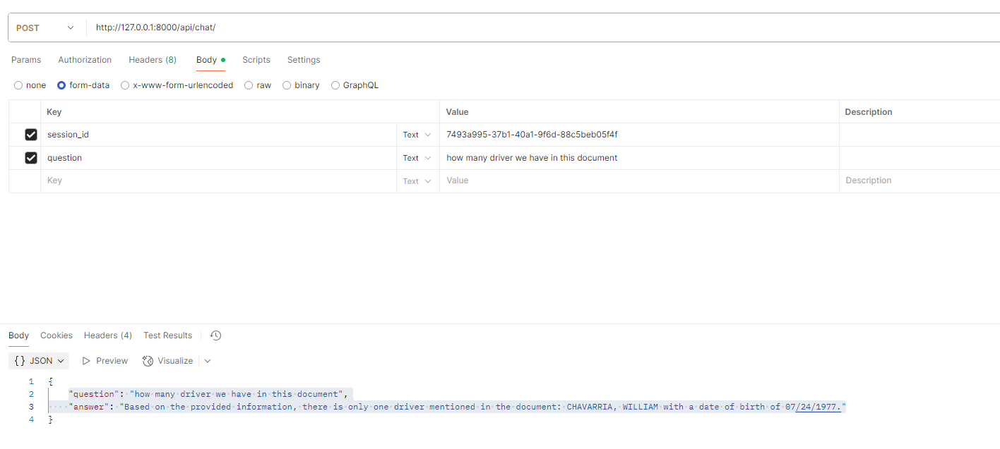

# FastAPI PDF Q&A Service

This project provides a lightweight FastAPI-based service that allows users to:

1. **Upload a PDF or Image** and receive a `session_id`.
2. **Ask questions** about the uploaded content using the `session_id`.

---

## Core Technologies Used

| Tool/Library         | Purpose                                                                 |
|----------------------|-------------------------------------------------------------------------|
| **FastAPI**          | Backend API framework                                                   |
| **Uvicorn**          | ASGI server for serving the FastAPI app                                 |
| **python-multipart** | Enables file uploads in FastAPI                                         |
| **LangChain**        | Manages prompt orchestration, document retrieval, and LLM integration   |
| **OpenAI**           | Used for LLM-based answers (e.g., GPT-3.5 / GPT-4)                      |
| **ChromaDB**         | Local vector database for document chunk storage and similarity search  |
| **PyMuPDF (fitz)**   | PDF text extraction                                                     |
| **pytesseract**      | OCR engine to extract text from images                                  |
| **Pillow (PIL)**     | Image manipulation and format handling                                  |
| **tiktoken**         | Token counting and chunking for LLM context management                  |
| **python-dotenv**    | Manages secret keys and config from `.env` files                        |
| **git-filter-repo**  | Used to clean sensitive data (e.g., API keys) from Git history          |

---
## Features

- Upload PDF/Image files and extract their content
- Query extracted content using natural language (e.g., "What is the driver's license number?")
- Powered by LangChain, OpenAI, or other LLMs (configurable)
- Session-based context for follow-up questions

---

## API Endpoints

### 1. `POST --> /api/upload-pdf/`

**Description:** Upload a PDF or image file and receive a `session_id`.

**URL:** `http://127.0.0.1:8000/api/upload-pdf/`

**Request:**

- **Form-Data:** `file` (PDF or image)

**Response:**
```json
{
  "session_id": "7493a995-37b1-40a1-9f6d-88c5beb05f4f",
  "message": "PDF uploaded and processed."
}
```

---

### 2. `POST --> /api/chat/`

**Description:** Ask questions about the uploaded PDF or image using the `session_id`.

**URL:** `http://127.0.0.1:8000/api/chat/`

**Request Body:**
```json
{
  "session_id": "7493a995-37b1-40a1-9f6d-88c5beb05f4f",
  "question": "What is the vehicle registration number?"
}
```

**Response:**
```json
{
    "question": "how many driver we have in this document",
    "answer": "Based on the provided information, there is only one driver mentioned in the document: CHAVARRIA, WILLIAM with a date of birth of 07/24/1977."
}
```

---

## API UI Preview



---

## Setup Instructions

```bash
# 1. Clone the repo
git clone https://github.com/rakesh-falcon/langchain-openai-doc-chatbot.git
cd langchain-openai-doc-chatbot

# 2. Create virtual environment
python -m venv env
source env/bin/activate  # On Windows: env\Scripts\activate

# 3. Install dependencies
pip install -r requirements.txt

# 4. Run FastAPI app
uvicorn main:app --reload
```

---

## Important: Set Tesseract Path

If you're using Windows and `pytesseract`, make sure to set the correct path to the Tesseract executable:

```python
import fitz
import pytesseract
from PIL import Image
import io

# Update this path to your local Tesseract installation
pytesseract.pytesseract.tesseract_cmd = r"C:\Users\RakeshRanjan\AppData\Local\Programs\Tesseract-OCR\tesseract.exe"
```

---

## 📄 License

This project is licensed under the MIT License.

---

## Support

For issues, bugs, or feature requests, please open an issue on the [GitHub repo](https://github.com/rakesh-falcon/langchain-openai-doc-chatbot).